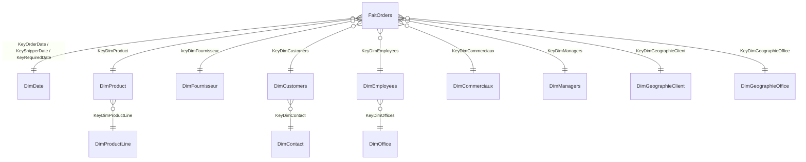

# RAPPORT DE PROJET : MACROBUS
## Conception et mise en œuvre d'un entrepôt de données pour l'aide à la décision

**Groupe n° XXXX**

| Membres du groupe | Matricule | E-mail |
|-------------------|-----------|--------|
| NOM Prénom 1 | … | … |
| NOM Prénom 2 | … | … |

Base de données : `MACROBUS_DWH_XXXX` · Projet SSIS : `MACROBUS_ETL_XXXX`
Outils : SQL Server (Developer), SSMS, Visual Studio + SSIS, Power BI Desktop

---

## Sommaire
1. Contexte et objectifs
2. Analyse de la source de production
3. Conception du modèle multidimensionnel en flocon
4. Implémentation physique du DWH
5. Processus ETL avec SSIS
6. Procédure stockée de chargement de la table de fait
7. Validation fonctionnelle (requêtes SQL)
8. Restitution Power BI
9. Difficultés rencontrées et solutions
10. Conclusion et perspectives
11. Annexes : liste des livrables

---

## 1. Contexte et objectifs

MacroBus vend des véhicules (modèles réduits de voitures, motos, avions, bateaux, trains, camions et bus) sur plusieurs marchés. Ces marchés sont organisés en 4 territoires (NA, EMEA, APAC, Japan) et 7 filiales (bureaux). L'entreprise reçoit des milliers de lignes de commande. Le PDG veut :

- **mesurer la performance de ses commerciaux dans le temps** ;
- **piloter l'activité** (chiffre d'affaires, volumes, produits, marchés) ;
- disposer d'un **système d'aide à la décision** fiable et rapide.

La base de production (OLTP) est optimisée pour la saisie des commandes, pas pour l'analyse : il faut beaucoup de jointures, il n'y a pas d'historisation par période et les requêtes sont lourdes. Nous avons donc construit un **entrepôt de données (DWH)** alimenté par un processus **ETL SSIS**, et un tableau de bord **Power BI** pour les décideurs.

## 2. Analyse de la source de production

La base `MACROBUS_PROD` (schéma *classicmodels*) contient 8 tables :

| Table | Lignes | Contenu |
|-------|-------:|---------|
| offices | 7 | Filiales (ville, pays, **territoire**) |
| employees | 23 | Employés, hiérarchie (`reportsTo`), fonction |
| customers | 122 | Clients, contact, commercial attitré (`salesRepEmployeeNumber`) |
| productlines | 7 | Catégories de produits |
| products | 110 | Produits, fournisseur (`productVendor`), prix d'achat, PVC |
| orders | 326 | En-têtes de commande (dates, statut) |
| orderdetails | 2 996 | Lignes de commande (quantité, prix unitaire) |
| payments | 273 | Paiements (non utilisée pour ce sujet) |

Les commandes vont du **06/01/2003 au 31/05/2005**.

Remarques issues de l'analyse :
- le **territoire** n'existe que sur `offices`. Le territoire d'une commande est donc celui de la filiale du commercial qui gère le client ;
- un **commercial** est un employé référencé par `customers.salesRepEmployeeNumber` (fonction *Sales Rep*) ;
- un **manager** est un employé dont au moins un autre employé dépend (`reportsTo`) ;
- certains prénoms de contacts contiennent des espaces en trop. Ils sont nettoyés (`LTRIM/RTRIM`) pendant l'ETL ;
- les commandes non expédiées ont `shippedDate = NULL`. Elles sont rattachées au membre « date inconnue » (-1) de DimDate.

## 3. Conception du modèle multidimensionnel en flocon

### 3.1 Processus métier et grain
- **Processus** : la prise de commande.
- **Grain** : *une ligne de commande*, c'est-à-dire un produit dans une commande (`orderNumber`, `productCode`).

Ce grain est le plus fin disponible. Il permet toutes les agrégations demandées : par commercial, produit, territoire, filiale et période.

### 3.2 Mesures
| Mesure | Calcul | Additivité |
|--------|--------|------------|
| QuantityOrdere | `orderdetails.quantityOrdered` | additive |
| unitPrice | `orderdetails.priceEach` | non additive |
| Montant | `quantityOrdered × priceEach` | additive |
| Nb commandes | `COUNT(DISTINCT orderNumber)` | semi-additive (comptage distinct) |

### 3.3 Dimensions
Nous avons repris le modèle proposé dans le sujet et l'avons **enrichi** avec une **DimDate** (3 rôles) et une **DimContact** :

| Dimension | Clé naturelle | Principaux attributs | Flocon |
|-----------|---------------|----------------------|--------|
| **DimDate** (nouvelle) | date (AAAAMMJJ) | jour, nom du jour, semaine, mois, trimestre, semestre, année | 3 rôles : commande / expédition / requise |
| DimProduct | productCode | nom, échelle, stock, prix d'achat, PVC | → **DimProductLine** |
| DimProductLine | productLine | description | |
| DimFournisseur | codeDuProduit | productVendor | |
| DimCustomers | customerNumber | nom, ville, pays, limite de crédit | → **DimContact** |
| **DimContact** (nouvelle) | customerNumber | prénom, nom, nom complet, téléphone du contact | |
| DimEmployees | employeeNumber | nom complet, fonction, e-mail | → **DimOffice** |
| DimOffice | officeCode | ville, pays, territoire, adresse | |
| DimCommerciaux | employeeNumber | commerciaux (*Sales Rep*) | |
| DimManagers | employeeNumber | managers (responsables hiérarchiques) | |
| DimGeographieClient | ville + pays + territoire | géographie du client | |
| DimGeographieOffice | ville + pays + territoire | géographie de la filiale | |

### 3.4 Schéma en flocon

*(Pour le rendu final, insérez une capture du **diagramme de base de données** généré dans SSMS : clic droit sur « Schémas de base de données », puis « Nouveau schéma », et ajoutez toutes les tables.)*

**Pourquoi un flocon ?** Les hiérarchies Produit → Catégorie, Client → Contact et Employé → Bureau sont normalisées. Cela évite la redondance (la description d'une catégorie n'est stockée qu'une fois), facilite la maintenance des dimensions et répond à la consigne du sujet. L'inconvénient (davantage de jointures) est négligeable vu les volumes.

**Pourquoi des clés de substitution ?** Les clés `IDENTITY` rendent le DWH indépendant des clés de production. Elles permettent d'historiser plus tard (SCD type 2) et rendent les jointures plus performantes (entiers).

## 4. Implémentation physique du DWH

Le script `02_creation_DWH_MACROBUS_DWH_XXXX.sql` :
- crée la base `MACROBUS_DWH_XXXX` et les 13 tables (12 dimensions + 1 fait) ;
- définit les clés primaires, une contrainte `UNIQUE` sur chaque clé naturelle et toutes les **clés étrangères** (intégrité référentielle du flocon) ;
- crée des index sur les clés de FaitOrders les plus filtrées (date, commercial, filiale) ;
- **remplit DimDate** du 01/01/2003 au 31/12/2006 (1 461 jours + 1 membre « inconnu »).

Volumétrie après chargement :

| Table | Lignes |
|-------|-------:|
| DimDate | 1 462 |
| DimProductLine | 7 |
| DimProduct | 110 |
| DimFournisseur | 110 |
| DimContact | 122 |
| DimCustomers | 122 |
| DimOffice | 7 |
| DimEmployees | 23 |
| DimCommerciaux | 17 |
| DimManagers | 6 |
| DimGeographieOffice | 7 |
| DimGeographieClient | 99 |
| **FaitOrders** | **2 996** |

## 5. Processus ETL avec SSIS

Projet `MACROBUS_ETL_XXXX`, package `Chargement_DWH.dtsx` (le guide détaillé est dans `02_GUIDE_SSIS.md`).

- **Connexions** : `CM_SRC_PROD` (source) et `CM_DWH` (cible), avec le fournisseur OLE DB Driver for SQL Server.
- **Flux de contrôle** en 3 étapes :
  1. *Conteneur « Dimensions niveau 1 »* : 8 Data Flows parallèles (dimensions sans parent).
  2. *Conteneur « Dimensions niveau 2 »* : DimProduct, DimCustomers et DimEmployees. Elles ont besoin de la clé de leur dimension parente.
  3. *Tâche Exécuter SQL* : `EXEC dbo.ps_ChargerFaitOrders`.
- **Modèle de Data Flow** : Source OLE DB → (Lookup parent) → Lookup d'existence sur la clé naturelle → sortie *Aucune correspondance* → Destination OLE DB. Seuls les nouveaux membres sont insérés, donc le **chargement est incrémental et rejouable**.

*(Insérez ici les captures d'écran du flux de contrôle et d'un flux de données.)*

## 6. Procédure stockée de chargement de la table de fait

`dbo.ps_ChargerFaitOrders` (script 04) :
1. **Extraction** : jointure `orders` × `orderdetails` × `customers` × `employees` × `offices` dans la base de production ;
2. **Transformation** : calcul du `Montant`, conversion des dates en clés AAAAMMJJ, `shippedDate NULL` → -1 ;
3. **Lookups** des 10 clés de substitution par jointure avec les dimensions ;
4. **Mise à jour** des lignes déjà chargées dont le statut ou la date d'expédition a changé ;
5. **Insertion** des nouvelles lignes uniquement (`NOT EXISTS`) ;
6. le tout dans une **transaction** avec `TRY…CATCH` (rollback en cas d'erreur). La procédure renvoie le nombre de lignes insérées et mises à jour.

Tests : 1er passage, 2 996 lignes insérées ; 2e passage, 0 insérée et 0 doublon. Le montant total du DWH (**9 604 190,61**) est identique à celui de la production.

## 7. Validation fonctionnelle (B-1)

Chaque question a été traitée **dans la production** (script 05) **et dans le DWH** (script 06). Les deux résultats sont **strictement identiques**, ce qui valide l'ETL. Toutes les commandes sont prises en compte, quel que soit leur statut.

### Q1 : Nombre et montant total des commandes par territoire
| Territoire | Nb commandes | Montant total |
|------------|------------:|--------------:|
| EMEA | 153 | 4 520 712,28 |
| NA | 119 | 3 479 191,91 |
| APAC | 38 | 1 147 176,35 |
| Japan | 16 | 457 110,07 |

→ L'EMEA représente **47 %** du chiffre d'affaires.

### Q2 : Top 2 des commerciaux qui reçoivent le plus de commandes
| Commercial | Nb commandes |
|------------|------------:|
| Gerard Hernandez (Paris) | 43 |
| Leslie Jennings (San Francisco) | 34 |

### Q3 : Les 3 produits les plus commandés au 2e trimestre 2003
| Produit | Quantité | Nb commandes |
|---------|--------:|------------:|
| 1992 Ferrari 360 Spider red | 95 | 3 |
| 1940s Ford truck | 91 | 2 |
| 1998 Chrysler Plymouth Prowler | 91 | 2 |

### Q4 : Montant par filiale et catégorie au 2nd semestre 2003 (extrait)
| Filiale | Catégorie principale | Montant |
|---------|---------------------|--------:|
| Paris | Classic Cars | 231 217,25 |
| London | Classic Cars | 208 210,50 |
| Boston | Classic Cars | 151 077,57 |
| NYC | Classic Cars | 148 189,05 |
| San Francisco | Classic Cars | 140 221,14 |
| Sydney | Classic Cars | 101 632,54 |
| Tokyo | Planes | 56 333,93 |

*(Résultat complet : 44 lignes, voir l'exécution du script 06.)*

## 8. Restitution Power BI (B-2)

Rapport `MACROBUS_XXXX.pbix` sur 3 pages (le détail est dans `03_GUIDE_POWER_BI.md`) :
1. **Vue d'ensemble** : KPI (CA, nombre de commandes, panier moyen, marge, livraison à temps), évolution mensuelle (pic de **novembre**), CA par catégorie et par année (2003 : 3,32 M ; 2004 : 4,52 M ; 2005 (janvier à mai) : 1,77 M).
2. **Performance des commerciaux** : Top N, matrice manager → commercial × année, panier moyen par commercial.
3. **Marchés et produits** : carte des clients, CA par territoire et catégorie, top produits et fournisseurs.

*(Insérez les captures d'écran des 3 pages.)*

## 9. Difficultés rencontrées et solutions
| Difficulté | Solution |
|------------|----------|
| Le territoire n'existe pas pour les clients | Territoire du client = territoire de la filiale de son commercial |
| `shippedDate` NULL (commandes en cours ou annulées) | Membre « date inconnue » (-1) dans DimDate |
| Plusieurs rôles de date | Une seule DimDate jouant 3 rôles (relations inactives + `USERELATIONSHIP` en DAX) |
| Ordre de chargement imposé par le flocon | Deux conteneurs de séquence (niveau 1 puis niveau 2) |
| Rejouabilité de l'ETL | Lookup « Aucune correspondance » + `NOT EXISTS` dans la procédure du fait |

## 10. Conclusion et perspectives
Le DWH `MACROBUS_DWH_XXXX` donne à la direction de MacroBus une vision consolidée et fiable de ses ventes. Les résultats sont identiques à ceux de la production, et les requêtes analytiques sont plus simples et plus rapides. Les décideurs peuvent désormais suivre leurs commerciaux, territoires et produits dans le temps avec Power BI.

**Perspectives** : historisation SCD type 2 (changement de commercial ou de filiale), ajout d'un fait « Paiements », planification quotidienne du package via SQL Server Agent, déploiement du rapport sur le service Power BI avec actualisation planifiée.

## 11. Annexes : livrables
1. Projet SSIS : dossier `MACROBUS_ETL_XXXX`
2. Scripts de création : `01_base_production_MACROBUS_PROD.sql`, `02_creation_DWH_MACROBUS_DWH_XXXX.sql`, `03_ps_chargement_dimensions.sql`, `04_ps_chargement_FaitOrders.sql`
3. Scripts de réponse : `05_requetes_base_production.sql`, `06_requetes_DWH.sql`
4. Ce rapport
5. Liste des membres du groupe (page de garde)
