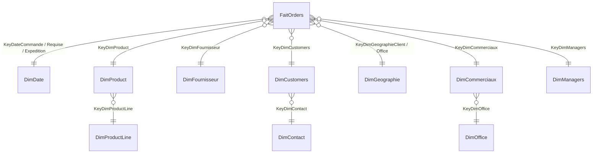

# Projet MacroBus — Entrepôt de données (guide étape par étape)

> Nomenclature : base **`MACROBUS_DWH_2`**, projet SSIS **`MACROBUS_ETL_2`**
> (groupe n° 2). Base de production (source) : **`MACROBUS_PROD`**, créée avec ses données par le script `00`.
> Elle a la structure de la base d'exemple *classicmodels* : offices, employees, customers, productlines,
> products, orders, orderdetails et payments.
>
> **Démarrage rapide SSIS : voir `ssis/PAS_A_PAS_SSIS.md`.**

## Contenu du dossier

| Fichier | Rôle | Exigence du sujet |
|---|---|---|
| `sql/00_MACROBUS_PROD_complet.sql` | Crée la base de production **MACROBUS_PROD** avec toutes ses données | — |
| `sql/01_creation_DWH.sql` | Crée le DWH en flocon (tables, clés, membres « Inconnu », synonymes vers la prod) | A-1, A-4, C-2 |
| `sql/02_procedures_chargement_dimensions.sql` | Chargement de DimDate + procédures de secours/contrôle des dimensions | A-2 |
| `sql/03_procedure_chargement_fait.sql` | **Procédure stockée de chargement de FaitOrders** + contrôle | A-3 |
| `sql/04_requetes_questions_PRODUCTION.sql` | Réponses aux 4 questions sur la prod | B-1, C-3 |
| `sql/05_requetes_questions_DWH.sql` | Réponses aux 4 questions sur le DWH | B-1, C-3 |
| `sql/06_vues_PowerBI.sql` | Vues pour la géographie à double rôle dans Power BI | B-2 |
| `ssis/PAS_A_PAS_SSIS.md` | **Clic par clic** : de votre écran actuel au package qui fonctionne | A-2, C-1 |
| `ssis/GUIDE_SSIS.md` | Référence : requêtes source de toutes les dimensions, package Master | A-2, C-1 |
| `powerbi/GUIDE_POWERBI.md` | Modèle, mesures DAX et visuels | B-2 |
| `rapport/PLAN_RAPPORT.md` | Plan détaillé du rapport à rendre | C-4 |

---

## Étape 1 — Comprendre le besoin

MacroBus veut **mesurer la performance de ses commerciaux dans le temps** et piloter les milliers de
commandes qu'il reçoit.
- **Processus métier** : la prise de commande.
- **Grain** : **une ligne de commande** (`orderNumber` + `productCode`). C'est le grain le plus fin, et il
  permet de répondre aux questions par produit ou par catégorie.
  > ⚠️ Dans le modèle fourni, `orderNumber` est la clé de `FaitOrders`. Ce n'est pas suffisant, car une
  > commande contient plusieurs produits. À justifier dans le rapport.
- **Mesures** : quantité, prix unitaire, montant (= quantité × prix), coût d'achat, marge, délai d'expédition et retard.
- **Axes d'analyse** : temps, produit, catégorie, fournisseur, client, contact, géographie, filiale, commercial et manager.

## Étape 2 — Le modèle en flocon proposé (exigence A-1)

Différences avec le modèle de l'enseignant, à justifier dans le rapport :
1. **Ajout de `DimDate`**, demandée par le sujet. Elle est utilisée trois fois (date de commande, date
   requise et date d'expédition) : c'est une *dimension à rôles multiples*.
2. **`DimGeographie` unique** (exigence A-4) au lieu de deux tables identiques. Elle est référencée deux
   fois par le fait : géographie du client et géographie de la filiale.
3. **`DimContact`** (exigence A-4) sort les informations de contact de `DimCustomers`. Cela forme un flocon.
4. **`DimEmployees` est remplacée** par `DimCommerciaux` (→ `DimOffice`, flocon) et `DimManagers`. Le
   « commercial » d'une commande est le *sales rep* du client, et son « manager » est son `reportsTo`.
5. **Membres « Inconnu » (clé -1)** dans chaque dimension : aucun NULL dans les clés du fait (par exemple
   pour une commande pas encore expédiée ou un commercial sans manager).
6. **Mesures supplémentaires** : `CoutAchat`, `Marge`, `DelaiExpeditionJours` et `LivreEnRetard`.

## Étape 3 — Créer l'entrepôt (C-2)

Dans SSMS :
1. Exécuter `00_MACROBUS_PROD_complet.sql` : il crée la base `MACROBUS_PROD` et ses données.
2. Exécuter `01_creation_DWH.sql`. Si votre base de prod a un autre nom, modifiez **uniquement** la
   section « SYNONYMES » à la fin du script.
3. Exécuter `02_procedures_chargement_dimensions.sql`, `03_procedure_chargement_fait.sql` et
   `06_vues_PowerBI.sql` (ces scripts ne font que créer des procédures et des vues).

## Étape 4 — Construire l'ETL SSIS (A-2, C-1)

Suivre **`ssis/GUIDE_SSIS.md`**. En résumé, un package par dimension, puis un package Fait qui appelle la
procédure stockée, le tout orchestré par un package Master.

> Pour tester votre DWH *avant* d'avoir fini SSIS, vous pouvez lancer :
> `EXEC dbo.sp_ChargerToutesDimensions; EXEC dbo.sp_ChargerFaitOrders; EXEC dbo.sp_ControleChargement;`

## Étape 5 — Charger la table de fait (A-3)

`EXEC dbo.sp_ChargerFaitOrders;` (appelée par SSIS via une *Execute SQL Task*). Cette procédure :
- cherche les clés de substitution par clé naturelle et met -1 si la clé est introuvable ;
- calcule les mesures ;
- fait un **MERGE** : elle insère les nouvelles lignes et met à jour celles qui ont changé. On peut donc la
  relancer sans créer de doublons ;
- s'exécute dans une transaction et trace chaque exécution dans `dbo.EtlLog`.

## Étape 6 — Valider (B-1)

Exécuter `04_…PRODUCTION.sql` puis `05_…DWH.sql`. **Les chiffres doivent être identiques.**
`EXEC dbo.sp_ControleChargement` compare aussi le nombre de lignes et le CA total entre la prod et le DWH.

### Résultats obtenus sur les données *classicmodels* (testés sur SQL Server 2022)

Contrôle global : 2 996 lignes, 326 commandes, **9 604 190,61** de CA, identiques en prod et dans le DWH.
Un second passage de la procédure donne 0 insertion et 0 mise à jour.

**Q1 — Commandes par territoire**

| Territoire | Nb commandes | Montant |
|---|---:|---:|
| EMEA | 153 | 4 520 712,28 |
| NA | 119 | 3 479 191,91 |
| APAC | 38 | 1 147 176,35 |
| Japan | 16 | 457 110,07 |

**Q2 — Top 2 commerciaux** : Gerard Hernandez (Paris) avec 43 commandes et 1 258 577,81, puis Leslie
Jennings (San Francisco) avec 34 commandes et 1 081 530,54.

**Q3 — Top 3 produits, T2 2003 (en quantité)** : 1992 Ferrari 360 Spider red (95), 1998 Chrysler Plymouth
Prowler (91) et 1940s Ford truck (91, ex aequo départagé par le montant).

**Q4 — S2 2003, total par filiale** : Paris 574 224,73 · San Francisco 472 457,00 · London 403 254,21 ·
Boston 285 520,59 · Sydney 248 640,00 · NYC 240 015,37 · Tokyo 171 868,03. Le détail par catégorie est
produit par le script.

> Conventions : le montant vaut `quantityOrdered × priceEach` ; toutes les commandes sont comptées, y
> compris celles au statut *Cancelled* ; le territoire et la filiale d'une commande sont ceux du bureau du
> commercial du client. Si votre jeu de données diffère, vos chiffres seront différents. Ce qui compte,
> c'est que **prod = DWH**.

## Étape 7 — Power BI (B-2)

Suivre **`powerbi/GUIDE_POWERBI.md`** (modèle, mesures DAX et 4 pages de rapport).

## Étape 8 — Rendre le travail (C)

Suivre **`rapport/PLAN_RAPPORT.md`** et rendre : le projet SSIS `MACROBUS_ETL_2` (dossier zippé), les
scripts `01`, `02`, `03` et `06`, les scripts `04` et `05`, le rapport (PDF) avec captures, le `.pbix` et
la liste des membres du groupe.
